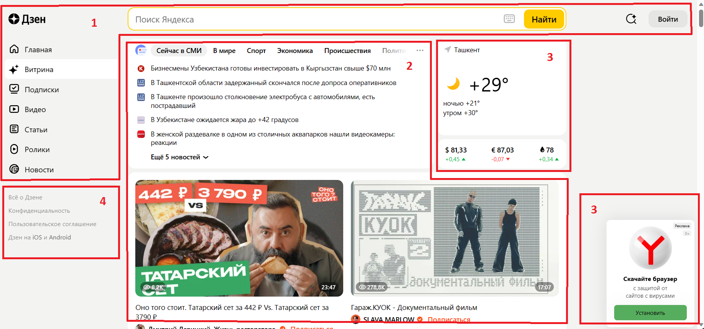
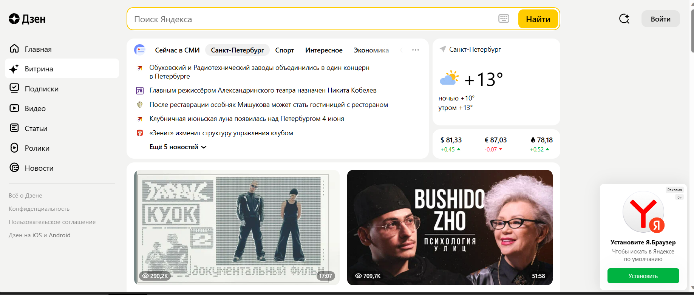
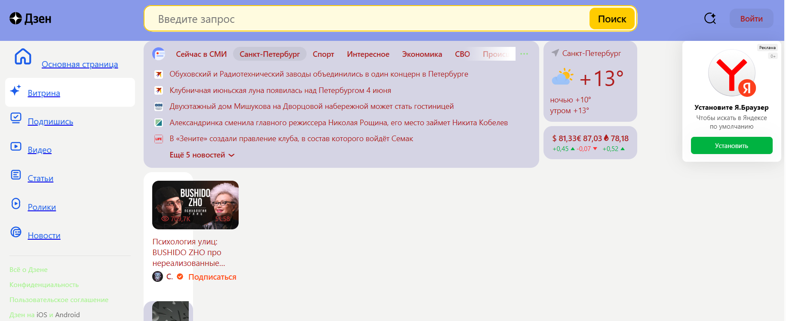
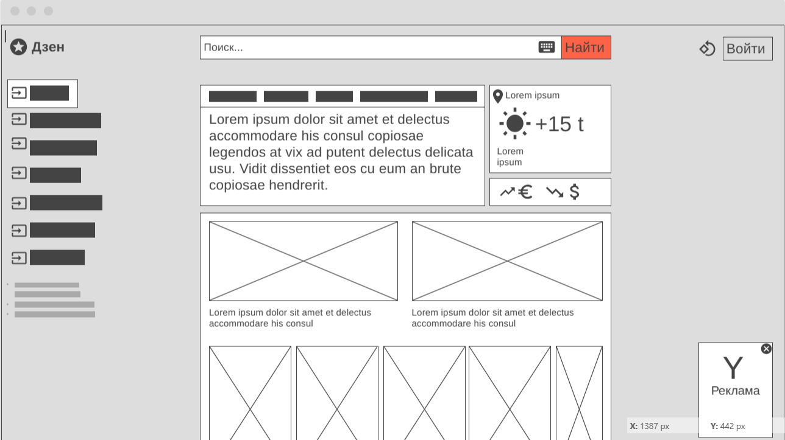

# Урок 1.
## Задача: на основе сайта [yandex.ru](https://dzen.ru/?yredirect=true):

- Определите, на каком протоколе работает сайт.
- Проанализируйте структуру страницы сайта.
- Внесите не менее 10 изменений на страницу с помощью инструмента разработчика и представьте скриншоты было/стало.
- Задание по желанию необязательное - Создайте прототип низкой детализации (дополнительное задание, если на семинаре дошли до задания №8).

### *1. Определите, на каком протоколе работает сайт.*

**HTTPS** - протокол передачи информации.

### *2. Проанализируйте структуру страницы сайта.*
1. Шапка (header)
2. Зона контента (content)
3. Зона виджетов
4. Подвал (footer)

### *3. Внесите не менее 10 изменений на страницу с помощью инструмента разработчика и представьте скриншоты было/стало.*

- *__Было:__*

- *__Стало:__*

### *4. Создайте прототип низкой детализации*
